# Aprendizados — socket-tcp

O que eu entendi descendo abaixo de HTTP e de framework: como o kernel expõe rede,
o que o runtime do Go faz por baixo de uma chamada que parece síncrona, e por que
"no Linux tudo é arquivo" deixa de ser frase de efeito quando você lê o `/proc`.

**Modelo de cada nota:** uma **pergunta-âncora** (o que eu queria descobrir antes de
rodar) → o **aprendizado consolidado** (o que ficou de pé depois de bater minha
hipótese contra o que o sistema mostrou ao vivo) → a **prova** (screenshot do
terminal + estação do lab + research + ideia central do README). As respostas já
estão corrigidas: refletem o confronto, não o palpite inicial.

> **Diário técnico** do estudo: a versão longa e em primeira pessoa do que o
> `README.md` da raiz resume. Cada nota nasce de um confronto entre hipótese e o
> que o kernel mostrou ao vivo.

---

## O método

O mesmo em todas as estações: **escrever a hipótese antes de rodar**, **rodar dentro
de containers Docker** e **observar a verdade no `/proc` e no `ss`** — não no que a
documentação promete, mas no que o kernel expõe ao vivo. Cada captura abaixo é um
momento de confronto entre o que eu achava e o que o sistema mostrou.

---

## Setup do ambiente

Antes de qualquer estação, provei que o laboratório era confiável. Dois containers
(`server` e `inspector`) compartilhando o mesmo **NET namespace** — então o inspector
enxerga os mesmos sockets do server — mas com **PID namespaces isolados**. O código
mora no macOS via bind mount e roda no Linux.

### NET namespace compartilhado

`docker compose ps` confirma `server` e `inspector` vivos, e `readlink
/proc/self/ns/net` devolve o **mesmo** inode de namespace nos dois containers. É isso
que torna o lab possível: o inspector observa os sockets do server porque eles
dividem a mesma pilha de rede.

### PID namespace isolado

`ps -ef` dentro do container mostra `PID 1 = sleep infinity` — não o `init` do macOS.
Dois mundos de processos, mesmo kernel. Entender essa fronteira foi o que me deixou
ler `/proc/<pid>/fd/` sem confundir o que é container e o que é host.

### Bind mount

Crio um arquivo dentro do container e ele aparece no macOS na hora. O bind mount é a
ponte: edito no editor do host, executo no Linux. Sem cópia, sem rebuild.

▸ ver captura

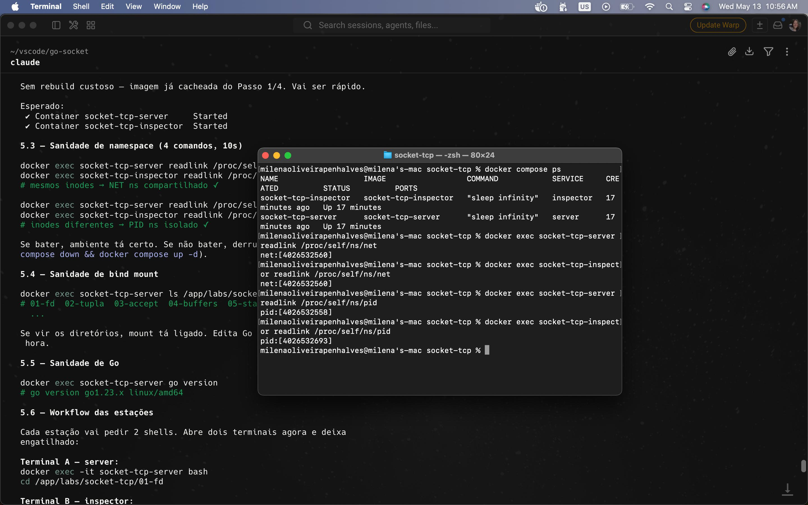
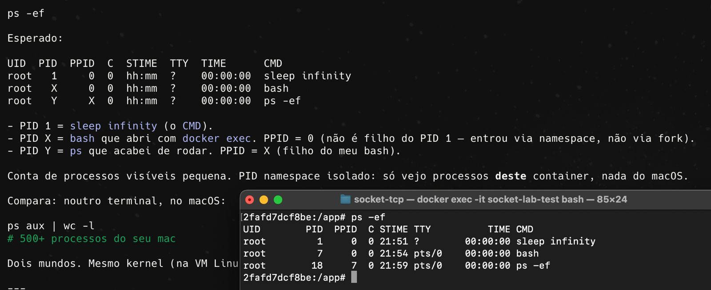
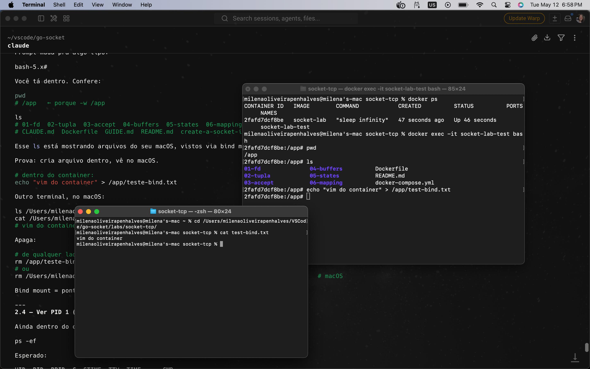

> **research** `lab/notebook/002_docker-setup-fundamentals.md`,
> `lab/notebook/003_proc-namespaces-inodes-readlink.md`.

---

## O que aprendi descendo a pilha

### 1. Socket é um FD no kernel — e quando `conn.Read()` "bloqueia", quem bloqueia? Como Go aguenta milhares assim?

**Pergunta-âncora:** quando chamo `net.Listen("tcp", ":8080")`, o que o kernel
devolve pro processo? E quando faço `conn.Read()` sem dado, o que trava de verdade?

A resposta materializada é um **file descriptor**. `readlink /proc/<pid>/fd/<n>`
mostra o FD do listener apontando para `socket:[<inode>]`, e ali do lado os FDs
`anon_inode:[eventpoll]` — o **netpoller** do runtime Go, o epoll em ação. "Socket é
arquivo" virou symlink que eu li com os próprios olhos.

E o bloqueio: `conn.Read()` parece síncrono e bloqueante, mas quem "bloqueia" é a
**goroutine**, não a thread do SO. Goroutine sempre roda *sobre* uma thread (o
runtime chama de `M`) — muitas goroutines multiplexadas em poucas threads, nunca
"goroutine no lugar de thread". `main` também é uma goroutine. Quando não há dado: o
fd está em modo não-bloqueante, a syscall retorna na hora com `EAGAIN`, o runtime
**estaciona** a goroutine e registra o fd no **netpoller** (epoll), liberando a
thread `M` pra rodar outra goroutine pronta. Quando o dado chega, o epoll avisa, o
runtime reagenda a goroutine dona e *ela* faz o `read`. Pra mim o código parece
travado naquela linha; por baixo, a thread nunca ficou parada. A ilusão síncrona é o
produto.

Por que não uma thread bloqueante por conexão: com 10k conexões seriam 10k threads,
cada uma com stack de MBs (GBs de RAM dormindo) e o kernel se esgotando em context
switch — o problema **C10k**. Goroutines custam ~2 KB e são agendadas em user space;
**um** `epoll_wait` vigia todos os fds e responde "quais estão prontos" (nunca os
dados). Isso é **multiplexação**: um observador, N canais — descarta tanto
thread-por-conexão quanto busy-poll (varrer fd por fd queimando CPU).

▸ ver captura

![FD do listener → socket:[inode] e FDs do netpoller/eventpoll](media/runs/01-fd.png)

> **estação** `lab/socket-tcp/01-fd` ·
> **research** `research/unix/002_threads.md`, `research/unix/005_blok-io.md`,
> `research/unix/006_poll-epoll.md`, `research/unix/001_the-file-abstraction.md`,
> `research/unix/004_vfs.md` · **README** Ideias centrais 1, 2, 3, 4 e 6.

### 2. A 4-tupla — como o kernel diferencia conexões sem colisão?

**Pergunta-âncora:** dois clientes conectam no mesmo `:8080`. Como o kernel
diferencia as conexões?

`ss -tn` revela duas conexões com **mesma porta local** (`:8080`) e **portas remotas
diferentes**. A identidade de uma conexão TCP não é a porta — é a **4-tupla**
(IP origem, porta origem, IP destino, porta destino). Por isso um servidor atende
milhares de clientes no mesmo `:8080` sem ambiguidade. (E cuidado: esgotar 4-tuplas
é limite distinto de esgotar fds por processo — volta nisso na estação 5.)

▸ ver captura

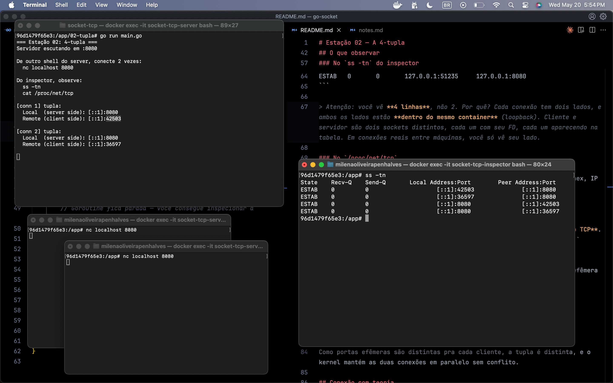

> **estação** `lab/socket-tcp/02-tupla` ·
> **research** `research/network/002_socket-tcp.md`.

### 3. Listener ≠ conexão — `accept()` reusa o socket ou cria um novo?

**Pergunta-âncora:** quando o servidor faz `accept()`, ele reusa o socket que escuta
ou cria um novo?

Cada `accept()` cria um **FD novo** para a conexão; o **Listener FD permanece** o
mesmo, sempre em `LISTEN`. O socket que escuta e o socket que conversa são objetos
distintos no kernel — é o que permite aceitar o próximo cliente enquanto os
anteriores seguem ativos. (E é exatamente por isso que o loop de `Accept` precisa de
`go func()` por conexão: sem goroutine separada, o `Read` do primeiro cliente parka a
goroutine principal e o servidor fica surdo a novos `Accept`.)

▸ ver captura

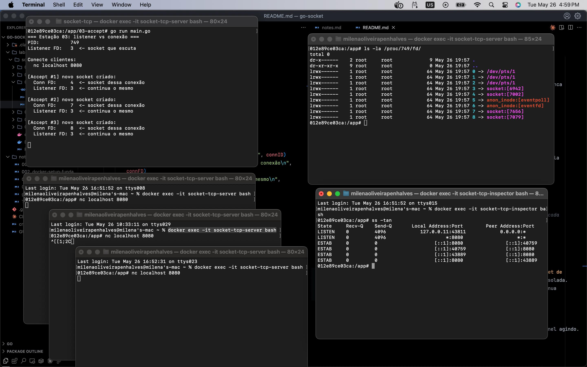

> **estação** `lab/socket-tcp/03-accept` ·
> **research** `research/network/004_handshake.md`,
> `lab/notebook/004_concurrency.md` · **README** Ideia central 4.

### 4. `write()` escreve no buffer, não na rede — quando `Write()` retorna, o dado já saiu?

**Pergunta-âncora:** o cliente faz `conn.Write(payload_grande)` e o receiver não lê.
O que acontece com o `Write`? Bloqueia? Quando? Por quê?

Não saiu. Mesmo retornando "ok", o dado está no **send buffer do kernel** — não na
placa de rede, não no outro lado. `Write` significa "copiei pro buffer", não
"entreguei". Primeiro o contador de bytes sobe rápido (`Write` retorna na hora); no
`ss -tn` o **Send-Q** cresce — os bytes foram pro buffer, não pra rede.

Se o receiver não drena, o **recv buffer** dele enche; o TCP anuncia uma janela de
recepção (campo **Window** / `rwnd` no header) cada vez menor, até zero, e o send
buffer para de aceitar — aí o `Write` bloqueia e o contador **congela**. Isso é
**backpressure** via **flow control**, que protege o **receptor** (não estourar o
buffer dele). Diferente de **congestion control**, que protege a **rede** (não
afogar os roteadores no meio). Na tela: Recv-Q congela → Send-Q trava → `Write`
bloqueia. Vi o mecanismo, não li sobre ele.

▸ ver captura

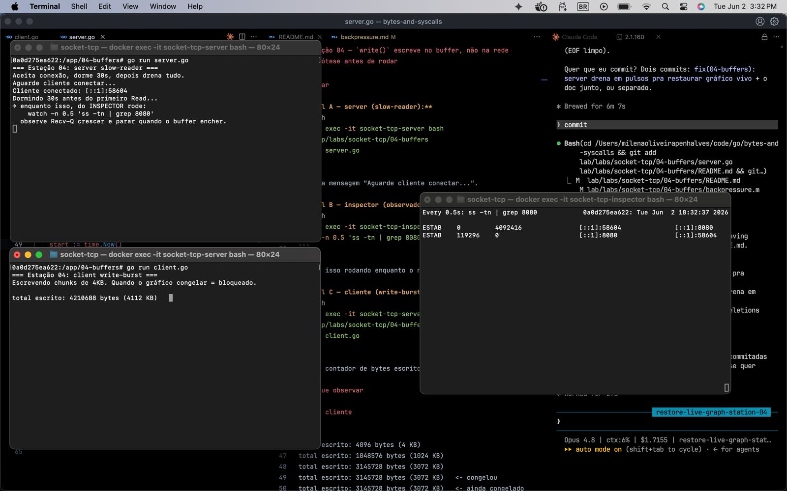
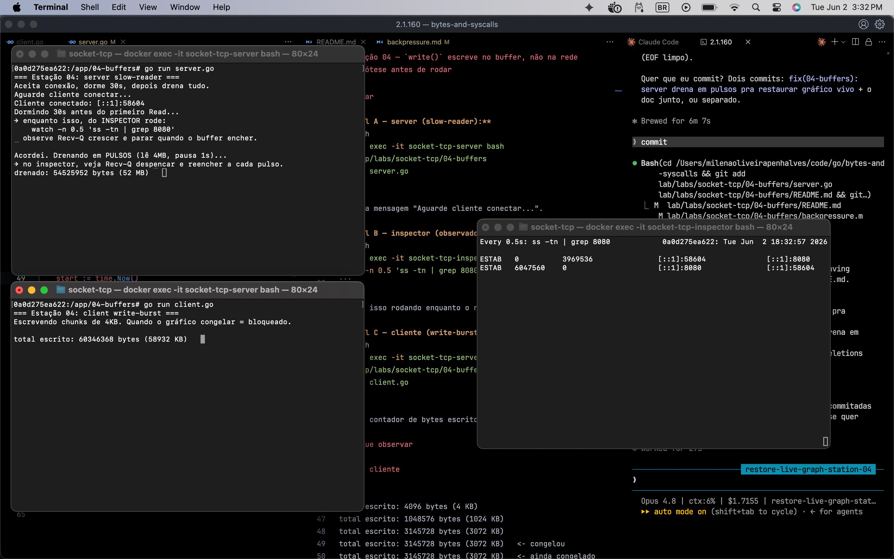
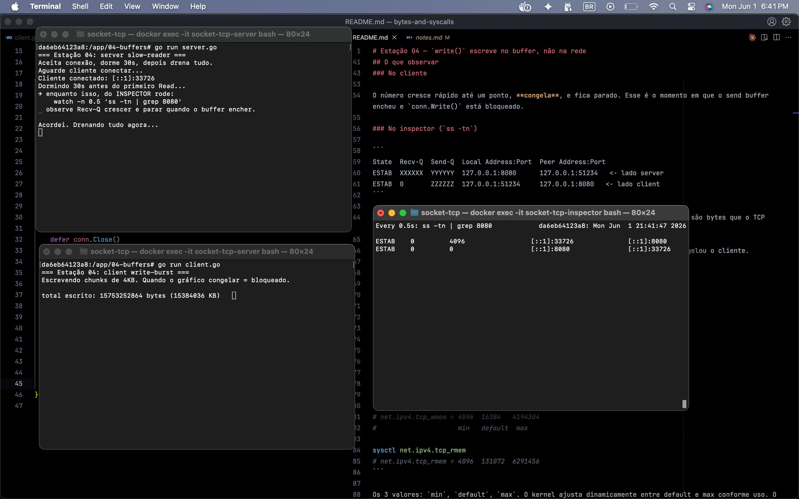

> **estação** `lab/socket-tcp/04-buffers` · **research** `research/unix/005_blok-io.md`,
> `research/network/003_io-bound-socket.md` · **README** Ideia central 1.

### 5. Estados TCP ao vivo — por que `CLOSE_WAIT` acumulando é bug, e o que `defer` tem a ver?

**Pergunta-âncora:** por que existe `TIME_WAIT`? E `CLOSE_WAIT`? Qual é saudável e
qual é sinal de bug?

Estados que vi ao vivo: `LISTEN`, `ESTABLISHED`, `TIME_WAIT`, `CLOSE_WAIT`.

`TIME_WAIT` é de quem faz o **active close** (manda o FIN primeiro): espera ~2×MSL
pra garantir que o ACK final chegou e impedir que um pacote atrasado da conexão velha
contamine uma nova na mesma 4-tupla. É saudável.

`CLOSE_WAIT` é de quem **recebeu FIN e não chamou `close()`** no próprio lado. Se
acumula, é o **meu** processo vazando file descriptors. O vazamento é silencioso —
nenhum erro — até bater o teto de fds (`too many open files`), que é limite **por
processo** (`ulimit -n` / `RLIMIT_NOFILE`), coisa distinta de esgotar portas
(4-tupla). São dois limites diferentes.

`defer conn.Close()` não é obrigação da linguagem — é açúcar de design que roda na
saída da função. Garantir o `close` continua sendo disciplina minha; o `defer` só
torna difícil esquecer.

▸ ver captura

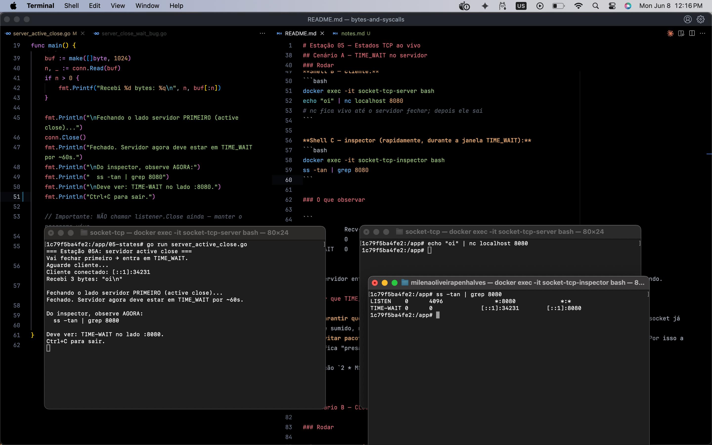
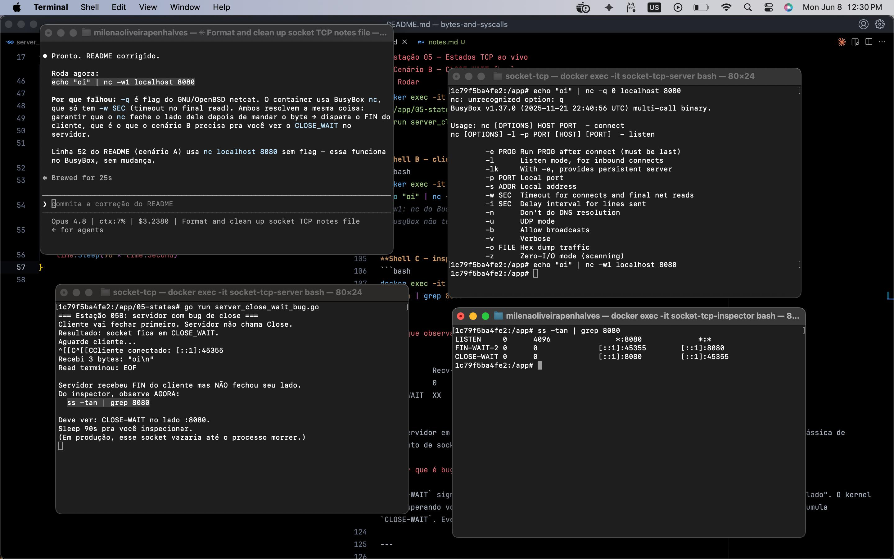

> **estação** `lab/socket-tcp/05-states` · **research** `research/network/004_handshake.md` ·
> **README** Ideia central 5.

### 6. A cereja: `ss -tnp` diz qual processo é dono de cada socket. Como, sem mágica?

**Pergunta-âncora:** `ss -tnp` mostra qual processo é dono de cada socket. Como? Não
é mágica — está em `/proc`.

A chave é o **inode do socket**. Ele aparece em dois lugares:
- `/proc/net/tcp` — a tabela de sockets, uma linha por conexão, com o inode;
- `/proc/<pid>/fd/` — symlink `socket:[<inode>]`.

Indexando um pelo outro, monto `inode → pid` e reconstruí o que `ss -p` faz por
baixo. A corrente completa: **fd** (tabela do processo) → **entrada na tabela de
arquivos abertos** → **objeto socket** → **inode de socket** → que aparece em
**`/proc/net/tcp`**. Esse inode é de socket (vive no `sockfs`), não de disco — mesmo
conceito, espaço diferente. Aqui todos os conceitos das estações anteriores se
juntam: fd, socket, inode e processo numa coisa só.

▸ ver captura

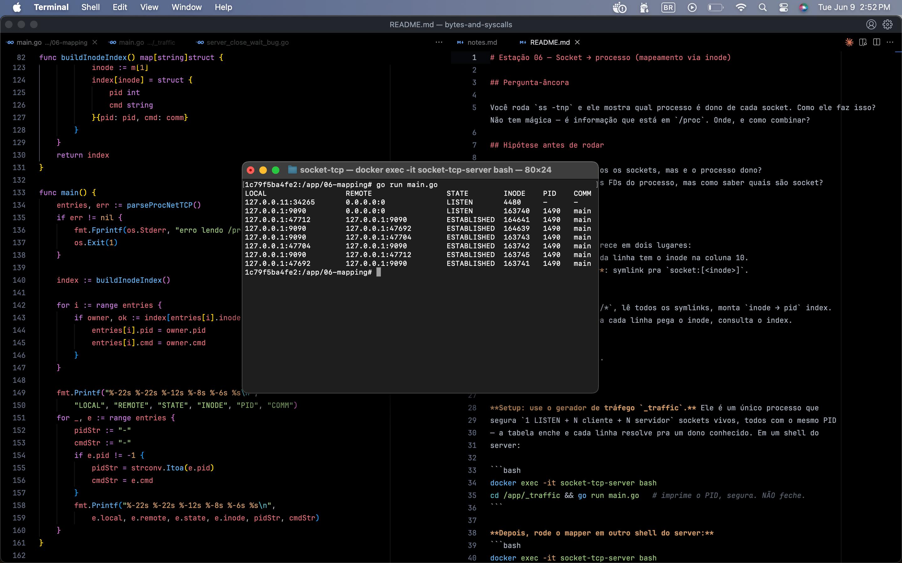

> **estação** `lab/socket-tcp/06-mapping` · **research** `research/unix/001_the-file-abstraction.md`,
> `lab/notebook/003_proc-namespaces-inodes-readlink.md` · **README** Ideia central 6.

---

## Nota de método: como usei IA

Parti de um único trecho de criação de socket e usei IA para montar o lab
progressivo — cada estação exige a anterior, e fechar uma só vem depois de
entender a de antes. A ferramenta tirou o atrito de montagem e me levou mais rápido
ao ponto onde o estudo de fato mora: o choque entre a minha hipótese e o que o
kernel mostra ao vivo.

O critério que separa parceria de terceirização: **eu preciso conseguir explicar
por que o código funciona**, não só vê-lo passar. Cada trecho eu rodei, li,
questionei e — quando foi o caso — reescrevi. Nem todo caminho foi limpo; parte do
código precisou ser reavaliada.
