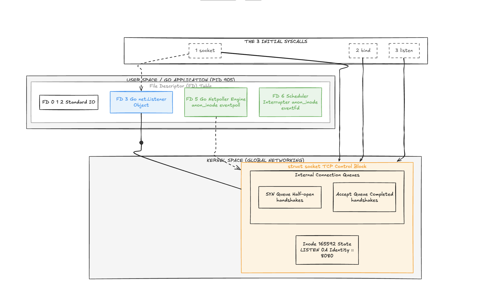

# Diagrama da Estação



A separação de privilégios do sistema operacional (User Space vs. Kernel Space) e como o Go se pendura nas chamadas de sistema para criar sua infraestrutura.

---

## The 3 Initial Syscalls: As 3 Syscalls Iniciais

O bloco posicionado no topo mostra o fluxo de inicialização disparado pelo comando `net.Listen("tcp", ":8080")`. Note como as três caixas tracejadas interagem de formas diferentes com o sistema:

* **`1 socket`:** Esta chamada cruza a fronteira do Kernel para alocar a estrutura de rede. Ela possui duas setas de saída: uma que cria a estrutura laranja no Kernel e outra que retorna um índice numérico (`FD 3`) para a tabela do processo.
* **`2 bind`** e **`3 listen`**: Como vimos no resumo, elas não devolvem novos arquivos ou FDs. Elas apontam diretamente para a estrutura laranja no Kernel, alterando seu estado interno (injetando a identidade `:::8080` e inicializando as filas).

---

## PID 905: Espaço do Usuário e a Ilusão do Processo 

Esta caixa representa a memória isolada do seu programa Go. O coração desta camada é a **File Descriptor (FD) Table** (a tabela de structs indexada por inteiros):

* **FD 0, 1, 2 (Standard IO):** Alocados automaticamente pelo sistema operacional para entrada, saída e erro padrão (sua tela e seu teclado).
* **FD 3 (Go net.Listener Object):** Este é o retorno físico da chamada `net.Listen`. No diagrama, ele está conectado por uma **linha sólida com um nó rígido** à estrutura do Kernel. Isso ilustra perfeitamente o conceito de **alça (handle)**: o processo Go não possui o socket dentro dele; ele possui apenas o número `3`, que aponta para o objeto real guardado pelo Kernel.
* **FD 5 e FD 6 (O Segredo do Netpoller):** O diagrama capturou perfeitamente o comportamento autônomo do runtime do Go. Ao abrir um listener, o Go secretamente aloca uma instância do `epoll` (`anon_inode:eventpoll`) e um sinalizador de interrupção (`eventfd`). A linha tracejada que sai do FD 5 mostra o Netpoller "vigiando" silenciosamente a atividade do socket.

---

## Kernel Space - Global Networking: Espaço do Kernel 

Aqui reside a infraestrutura real e global do sistema operacional, oculta da aplicação. A grande caixa laranja é a materialização da `struct socket`:

* **O Elo Universal (`Inode 165592`):** É o número de identidade global deste socket no Kernel. Se você rodar um `ss -tlnp`, o Linux usará este Inode para dizer que o FD 3 do PID 905 é o dono desta porta.
* **Estado e Identidade (`LISTEN 0A` / `[::]:8080`):** O diagrama mostra o socket configurado como Dual-Stack (`::`), escutando na porta 8080, com o estado mapeado em hexadecimal no arquivo do sistema como `0A`.
* **As Duas Filas de Conexão (Internal Connection Queues):**
* **SYN Queue:** O "purgatório" do TCP. Quando um cliente inicia o aperto de mão, ele cai aqui. O processo Go nem sabe de sua existência ainda.
* **Accept Queue:** O "saguão de espera". Quando o handshake fecha, a conexão é movida para cá. Ela fica aguardando pacientemente até que o seu loop dispare um `listener.Accept()`, que extrairá o cliente dali e criará o próximo FD (o FD 4, que vimos no diagrama da Estação 2).


---

### Resumo Visual da Conexão dos Conceitos

```
 SEU CÓDIGO GO             TABELA DE FDS                KERNEL (HARDWARE)
┌──────────────┐          ┌──────────────┐            ┌────────────────────┐
│ net.Listen() │ ───────> │    FD 3      │ ─────────> │ Inode 165592       │
└──────────────┘          └──────────────┘            │ State: LISTEN (0A) │
 (Abstração)               (Alça/Inteiro)             └────────────────────┘
                                                       (Objeto Real no SO)

```