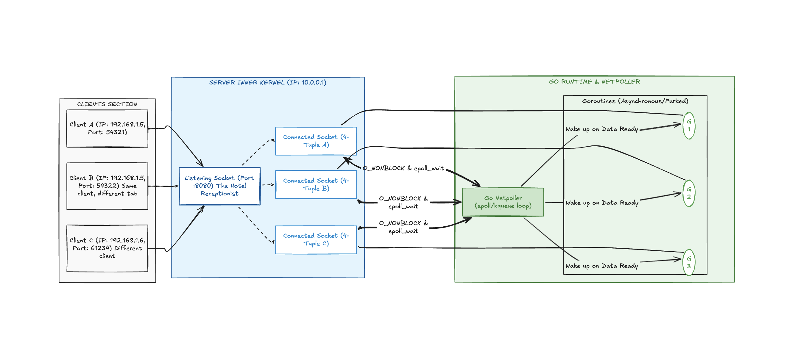

# Diagrama da Estação

Este diagrama ilustra o ciclo de vida completo de uma requisição de rede, dividida em três macro-camadas: a **Origem (Clientes)**, o **Gerenciamento de Estado do Kernel (Tabela de Sockets)** e a **Camada de Aplicação Assíncrona (Go Runtime)**.

---

## Clients Section: A Origem e a Prevenção de Colisões

O fluxo começa no bloco cinza, que representa o tráfego vindo da internet ou da rede interna para o servidor (`10.0.0.1`).

* **Cliente A e Cliente B (O cenário do mesmo computador):** Note que ambos possuem o mesmo IP de origem (`192.168.1.5`). Isso simula um usuário com duas abas do navegador abertas. O kernel do cliente evita a colisão gerando duas **portas efêmeras** distintas: `54321` e `54322`.
* **Cliente C:** Representa um usuário completamente isolado em outra máquina (`192.168.1.6`), cuja diferenciação ocorre primariamente pelo IP.

---

## Server Inner Kernel: O Funil do Kernel e a Estratégia do Hotel

O bloco azul representa o espaço de memória do Kernel do Linux no servidor. Aqui acontece a mágica da multiplexação.

* **O Funil (`Listening Socket :8080`):** Todas as conexões físicas (as setas pretas contínuas) batem inicialmente no mesmo lugar: a porta pública `:8080`. Como vimos na analogia, esta é a **recepcionista**. Ela processa o *3-way handshake*.
* **A Delegação (Setas Tracejadas):** A recepcionista não segura o cliente. Assim que a conexão é estabelecida, o Listening Socket "da um passo para o lado" e spawna (gera) três **Connected Sockets** independentes.
* **As 4-Tuplas:** Cada caixa azul à direita representa um File Descriptor único no Linux. O kernel consegue diferenciar o tráfego perfeitamente porque as chaves compostas (4-tuplas) são completamente diferentes entre si na memória.

---

## Go Runtime & Netpoller: A Ilusão Síncrona do Go

O bloco verde mostra como o Go lida com esses três sockets de forma ultra-eficiente sem travar a máquina.

* **A Linha de Produção Concorrente:** Cada *Connected Socket* possui uma linha direta de comunicação com uma Goroutine dedicada (`G1`, `G2` e `G3`). No seu código Go, isso equivale ao momento em que você dá um `go func(net.Conn)` logo após o `Accept()`.
* **O Estado de Espera (*Parked*):** Repare que as Goroutines estão dentro de um bloco tracejado chamado *Asynchronous/Parked*. Elas estão "pausadas". Se o cliente conectar mas não enviar nenhum dado, a Goroutine não consome CPU; ela fica dormindo.
* **O Policiamento (`O_NONBLOCK & epoll_wait`):** Em vez de deixar três Threads do Sistema Operacional travadas esperando dados, os sockets avisam o **Go Netpoller** que operam em modo não-bloqueante. O Netpoller centraliza esses File Descriptors em uma lista única e fica escutando o kernel através do `epoll_wait`.
* **O Despertar (`Wake up on Data Ready`):** Quando o Cliente A finalmente envia bytes pela internet, o hardware avisa o Kernel, que avisa o Netpoller. O Netpoller imediatamente identifica: *"Esses bytes pertencem à 4-Tupla A, logo, preciso acordar a Goroutine 1"*. A seta aponta para cima, a `G1` assume a CPU, processa os dados instantaneamente e devolve a resposta.

---

Olhando para a mecânica do **Netpoller** controlando essas Goroutines pausadas, você consegue visualizar o impacto que teria no sistema se o Go utilizasse Threads puras do Sistema Operacional (como o Java antigo ou o C++ tradicional) em vez de Goroutines para gerenciar esse mesmo fluxo?