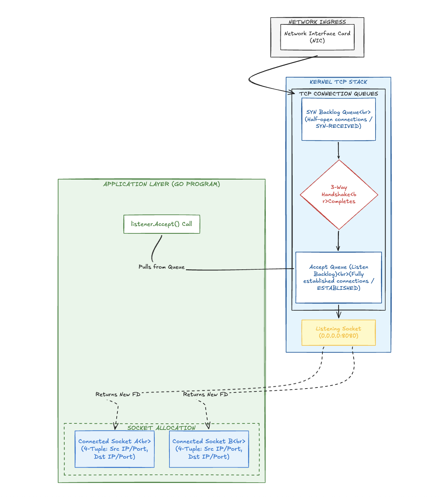

# Diagrama da Estação

O diagrama apresenta o fluxo de estabelecimento de conexões TCP, dividindo o processo técnico em três áreas principais: a interface de rede física, as estruturas internas do sistema operacional (Kernel) e a camada da aplicação (um programa escrito em Go).

Aqui está o resumo objetivo dos componentes e do caminho percorrido pelos dados:

### 1. Entrada de Rede (*Network Ingress*)

* O fluxo inicia na **Placa de Interface de Rede (NIC)**, responsável por receber os pacotes da rede externa e repassá-los para o sistema operacional.

### 2. Pilha TCP do Kernel (*Kernel TCP Stack*)

O sistema operacional processa a chegada da conexão utilizando um **Socket de Escuta (*Listening Socket*)** fixado no endereço `0.0.0.0:8080` e gerencia as requisições através de duas filas de conexão (*TCP Connection Queues*):

* **Fila de SYN (*SYN Backlog Queue*):** Recebe as tentativas iniciais de conexão. Estas são classificadas como conexões semiabertas (*Half-open connections / SYN-RECEIVED*).
* **Transição (*3-Way Handshake Completes*):** Representa o momento em que o protocolo de estabelecimento de conexão é concluído com sucesso.
* **Fila de Aceitação (*Accept Queue / Listen Backlog*):** Armazena as conexões que finalizaram o processo anterior e agora estão totalmente estabelecidas (*ESTABLISHED*), prontas para serem entregues à aplicação.

### 3. Camada de Aplicação (*Application Layer - Go Program*)

Ilustra a ação do software consumindo as conexões preparadas pelo Kernel:

* **A Chamada `listener.Accept()`:** A função da aplicação extrai (*Pulls from Queue*) as conexões prontas da *Accept Queue*.
* **Retorno de um Novo FD (*Returns New FD*):** Para cada conexão extraída, o sistema entrega um novo identificador (*File Descriptor*).
* **Alocação de Sockets (*Socket Allocation*):** Cria-se um socket dedicado e independente para cada cliente (exemplificados como *Connected Socket A* e *Connected Socket B*). O diagrama destaca que cada um desses novos sockets é unicamente identificado por uma **Tupla de 4** (*4-Tuple*), composta por IP/Porta de origem e IP/Porta de destino.